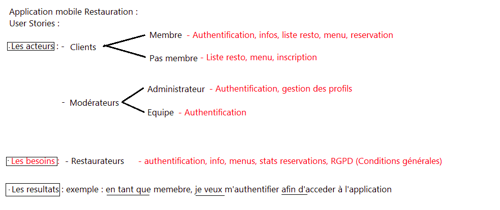

# NFE114 16 04 2025

## Agilité 

Représente les 3 éléments :

- Lesindividus et leur interactions
- Des logiciels opérationnels
- L'adaptation au changement

Product BackLog : 
Product Owner :
Sprint backlog :
Equipe :
Daily meeting :
Sprint :  
Produit lirable :

## Scrum 

USER STORIES :

| En tant que | Je voudrais | Afin de |
| :---------------: |:---------------:| :-----:|
| Visiteur | Visualiser la page d'acceuil | Voir les dernière offre du moment  |
| Visiteur | Chercher un restaurant | Trouver un endroit ou manger |
| Visiteur | Vérifier les restaurants autour de moi | Trouver un endroit ou manger |
| Visiteur | M'inscrir | Pouvoir reserver un restaurant |
| Visiteur | Me connecter | Pouvoir reserver un restaurant |
| Membre | Pouvoir reserver un restaurant | Organiser un repas en restaurant |
| Membre | D'accèder a un profil | Pouvoir changer mes données |
| Membre | Supprimer mon compte | Pouvoir converserver mon anonyma sur internet |
| Modératuer | Ajouter une annonce | Promouvoir un restaurant |
| Admnistrateur | Accèder au back office | Pouvoir gérer les rôles utilisateur |

quel est m'inportance entre Scrum master et product owner

