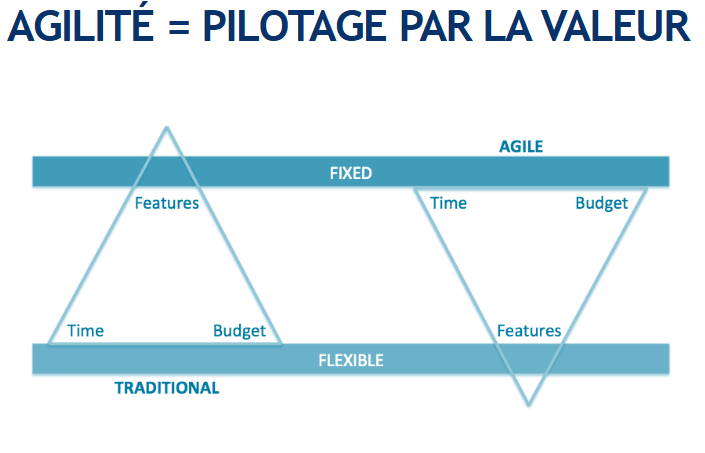
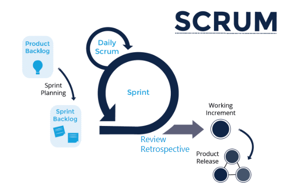

# Revision NFE114

## Agil

>origine USA, en 2001

### Les étapes d’un projet classique

- besoin
- analyse des besoins
- etude de faisabilité
- expression des besoins
- cahier des charges
- expression fonctionnel
- etude
- modelisation
- dev

### Faiblesses méthode classique :

- peu d’adaptation aux changement du client
- peu de relation avec le client
- faible gestion de l’incertitude et du risque

### Objectif de l’agilité :

- trouver un compromis entre minimum de méthode tout en restant adaptable et créatif
- accepter le changement des besoins et être capable d’y répondre
- privilégier le code plutôt que la documentation

### Les moyens :
- utiliser un dev iteratif et incrémental
- decouper le besoin et prioriser
- decouper la réalisation : livrer fréquemment des incrément de produit, accepter les changement
-controler régulièrement l’avancement avec les parties prenantes

Def partie prenante : `personne qui est intéressé d’une façon ou d’une autre par le produit réalisé par l’ équipe`

### Manifeste Agile

- Individus et interactions   -plutot-que-> Procédures et outils
- Un logiciel fonctionne      -plutot-que-> Documentation exhaustive
- Collaboration avec le clien -plutot-que-> Négociation du contrat
- Adaptation au changement    -plutot-que-> Exécution d'un plan

### Facteurs de succès des méth. agiles

- Le client / l’utilisateur (ou son représentant) est impliqué quotidiennement
- Le management intermédiaire soutient l’équipe
- L’équipe est auto-organisée
- Les pratiques sont adaptées au mode incrémental
    - "Des tests automatisés : rejoués souvent
    - Code compréhensible car va être sans doute modifié
    - Code collectif

### Attentes et bénéfices des Méth Agiles

#### Attentes
1. Accélérer la livraison des logiciels et leur mise sur le marché (75%)
2. Bien gérer les changements de priorité dans les besoins des utilisateurs (64%)
3. Accroître la productivité des équipes (55%)
4. Mieux aligner les attentes du Métier et de la DSI (49%)
5. Améliorer la qualité du code produit (46%)

#### Bénéfices

1. Bien gérer les changements de priorité dans les besoins des utilisateurs (71%)
2. Avoir une bonne visibilité des projets
3. Mieux aligner les attentes du Métier et de la DSI (65%)
4. Accélérer la livraison des logiciels et leur mise sur le marché (62%)
5. Accroître la productivité des équipes (61%)

## Scrum 

### ROLES SCRUM

- PRODUCT OWNER

    - Définit les caractéristiques du produit
    - Décide de la date de livraison et du contenu
    - Responsable du retour sur investissement du produit
    - Priorise les fonctions conformément à leurs valeurs business
    - Ajuste les priorités pour chaque sprint
    - Accepte ou rejette les résultats

- SCRUM MASTER

    - Responsable de la mise en œuvre des valeurs et des pratiques de SCRUM
    - Eliminer les obstacles
    - S’assurer que l’équipe est fonctionnelle et productive
    - Permettre la bonne coopération entre les divers rôles et fonctions
    - Protéger l’équipe de toute intervention extérieure

- EQUIPE DE DÉVELOPPEMENT

    - Entre 5 et 9 personnes
    - Pluridisciplinaire
    - Dédiée au projet
    - Auto organisée

- PARTIES PRENANTES

    - Personne, ou groupe de personnes qui a des intérêts sur un projet et qui est concerné par les résultats obtenus
    - Exemple de parties prenantes :
        - Marché
        - Client final / utilisateur
        - Stratégie d’innovation
        - Autres équipes de l’entreprise

- UTILISATEURS

    - Expert
    - Source d’information privilégiée pour 
        - Priorité
        - Détails des fonctionnalités

### CÉRÉMONIES

#### SPRINT PLANNING : PARTIE 1

Role : PRODUCT OWNER, SCRUM MASTER, EQUIPE DE DÉVELOPPEMENT, PARTIES PRENANTES
Temps : 90 min

- Présentation de l’objectif du sprint
- Présentation des stories
- Construction du backlog de sprint
- Engagement de l’équipe

#### SPRINT PLANNING : PARTIE 2

Role : SCRUM MASTER, EQUIPE DE DÉVELOPPEMENT
Temps : 60 min

- Conception en équipe
- Découpage en tâche
- Estimation des tâches

#### MÊLÉE QUOTIDIENNE

>C'est un daily

Role : SCRUM MASTER, EQUIPE DE DÉVELOPPEMENT
Temps : 15 min, tout les jours

- Qu’ai-je fait hier ?
- Que vais-je faire aujourd’hui ?
- Est-ce que je rencontre des obstacles ?

#### DÉMONSTRATION

Role : PRODUCT OWNER, SCRUM MASTER, EQUIPE DE DÉVELOPPEMENT, PARTIES PRENANTES, UTILISATEURS
Temps : 90 min

- Chacun présente ce qu’il a fait
- Le PO accepte ou rejette les résultats
- Le PO note les retour

#### RÉTROSPECTIVE

- Mise en condition
- Revue des précédentes actions
- Rassembler les données
-  Chercher des idées
- Plan d’action

## USER STORIES

`« En tant que, j'aimerai, afin de »`

| En tant que  | je voudrais | afin de |
|:--|:--|:--|
| Invité | pouvoir me créer un compte | créer un compte |
| Technicien | pouvoir ajouter des tickets à mon tableau | pouvoir accéder à mes tickets |
| Technicien | pouvoir ajouter des tickets à mon tableau | pouvoir tracer les interventions  |
| Technicien | pouvoir modifier mes tickets | rectifier et décrire l’avancée d’un ticket |
| Technicien | pouvoir organiser mes tickets | d’être organisé  |
| Technicien | pouvoir créer plusieurs tableaux Kanban | séparer les différents projets |
| Technicien | pouvoir m’authentifier |  d’accéder à l’application |
| Technicien | pouvoir ajouter des images à un ticket | ajouter des détails à mon ticket |
| Technicien | pouvoir rechercher mes tickets | retrouver mes anciens tickets  |
| Chef d’équipe | pouvoir assigner des tickets  | mieux gérer la résolution de ticket |
| Chef d’équipe| pouvoir m’authentifier | accéder à l’application |
| Chef d’équipe | pouvoir faire tout ce qu’un technicien peut faire | accès aux mêmes fonctionnalités |
| Administrateur | pouvoir gérer les rôles des utilisateurs | attribuer la bon rôle au bon utilisateur |
| Administrateur | je veux pouvoir m’authentifier | accéder à l’application |