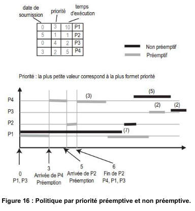
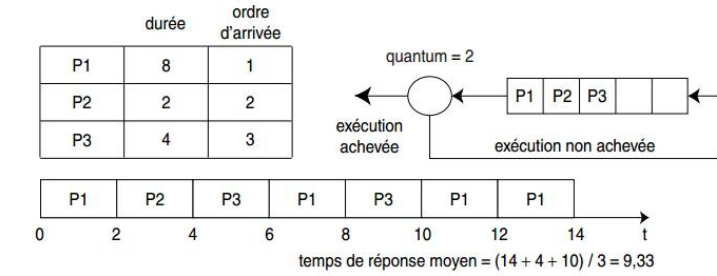

# UTC 502 17 12 24

## Oronnancement sur l'unité centrale

### A. Prolitique Premier Arrivé, Premier servi

- Les processus sont élus selon l’ordre dans lequel ils 
arrivent dans la file d’attente des processus prêts. 
- Il n’y a pas de réquisition.
- L’avantage de cette politique est sa simplicité.
- Inconvénient : les processus de petit temps d’exécution 
sont pénalisés en terme de temps de réponse par les 
processus de grand temps d’exécution qui se trouvent 
avant eux dans la file d’attente.

### B. Politique Plus Court d’Abord

- Le processus de plus petit temps d’exécution est celui qui est ordonnancé en premier. 
- La politique est sans réquisition.
- Remédie à l’inconvénient cité pour la politique précédente du « Premier Arrivé, Premier Servi ».
- Politique est optimale dans le sens où elle permet d’obtenir le temps de réponse moyen minimal pour un 
ensemble de processus donné.
- La difficulté  : la connaissance a priori des temps d’exécution des processus.  Cette connaissance n’est pas 
disponible dans un système interactif. 
- Politique est essentiellement mise en œuvre dans les systèmes de traitement par lots.

### C. Politique par priorité

- La politique très courante.
- Chaque processus possède une priorité, un nombre positif . Selon le système d’exploitation, une valeur basse est plus prioritaire qu’une valeur haute ou inversement.
- Cette politique se décline en deux versions selon si la réquisition est autorisée ou non. La figure 16 donne un exemple d’application de cette politique en mode préemptif et en mode non préemptif.
- Un inconvénient de cette politique est le risque de famine pour les processus de petite priorité si il y a de nombreux processus de haute priorité. On dit aussi qu’il y a coalition des processus de forte priorité contre les processus de faible priorité

### D. Politique du tourniquet (round robin)
- Politique mise en œuvre dans les systèmes dits en temps partagé. 
- Le temps est découpé en tranches nommées quantums de temps. 
- Un processus est élu, il s’exécute au plus durant un quantum de temps.
- Si le processus n’a pas terminé son exécution à l’issue du quantum de temps, il est préempté et il réintègre la file des processus prêts mais en fin de file.
- Le processus en tête de file de la file des processus prêts est alors à son tour élu pour une durée égale à un quantum de temps.
- La valeur du quantum constitue un facteur important de performance de la politique, elle influe directement sur le nombre de commutations de contexte.

### Exemples :

#### Ordonnancement sous Unix
- L’ordonnanceur Unix est un ordonnanceur de type tourniquet, avec plusieurs niveaux de priorités.
- À un instant t, le processus élu est celui de plus forte priorité. 
- Le système effectue un recalcul des priorités mettant en œuvre un principe d’extinction de priorité afin de garantir une équité d’accès au processeur.

Exemple :

- Supposons que toutes les secondes, le système recalcule les priorités des processus élus et prêts selon le principe suivant : 

**Extinction** : compte_UC = compte_UC / 2 où compte_UC est le temps CPU consommé par le processus.

**Priorité** = compte_UC/2 + 40 où 40 est une priorité de base de niveau utilisateur.

Soient trois processus P1, P2 et P3, P1 de priorité 40 et P2, P3 de priorité 45. P1 s’exécute.

Au bout d’1 seconde : 
- Priorité P1 : compte_UC = 60/2 = 30 et priorité = 15 + 40 = 55
- Priorité P2, inchangée : 45
- Priorité P3, inchangée : 45
- P2 est élu

Au bout de 2 secondes : 
- Priorité P1 : compte_UC = 30/2 = 15 et priorité = 7 + 40 =  47
- Priorité P2 : compte_UC = 60/2 = 30 et priorité = 15 + 40 = 55
- Priorité P3, inchangée : 45
- P3 est élu

Au bout de 3 secondes : 
- Priorité P1 : compte_UC = 15/2 = 7 et priorité = 3 + 40 =  43
- Priorité P2 : compte_UC = 30/2 = 15 et priorité = 17 + 40 = 47
- Priorité P3 : compte_UC = 60/2 = 30 et priorité = 15 + 40 = 55
- P1 est de nouveau élu
