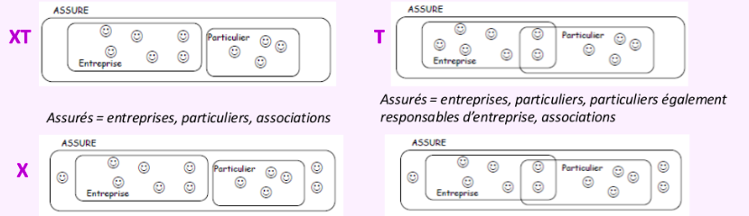
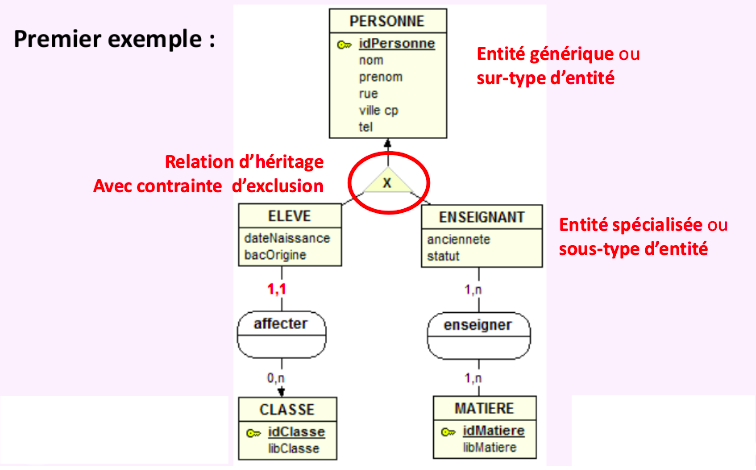
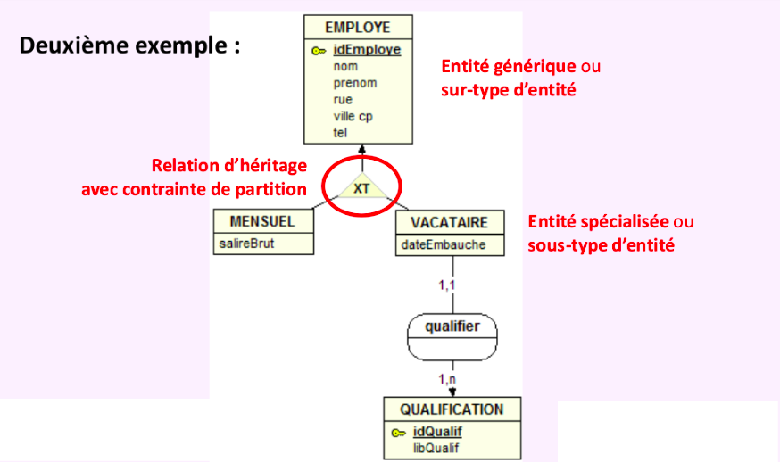
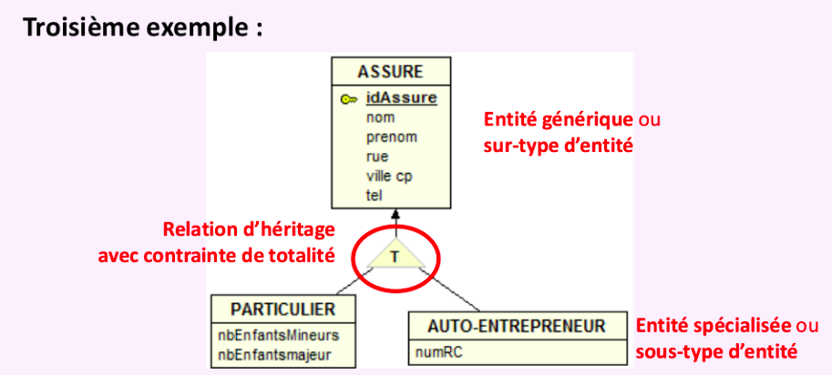
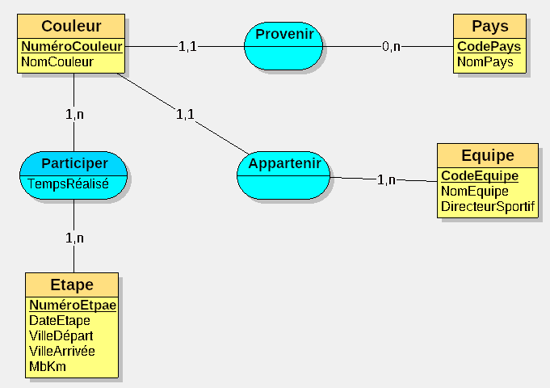
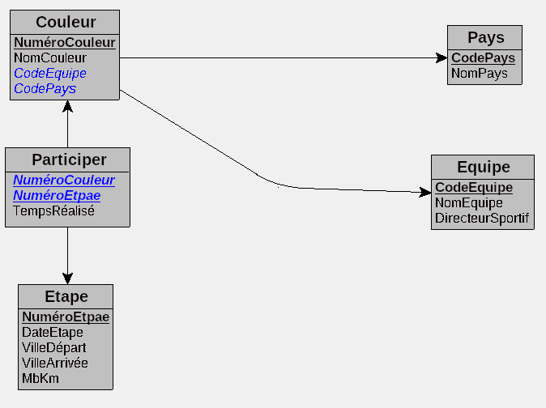

# Révision 504

## Le Système d'information

Qu'est ce qu'un système d'information ?
***L'ensemble des ressources, matériels et imatériel necessaire et suffisante pour assurer le bon fonctionnement d'une structure.***

Le S.I. est au service de l’entreprise 
- L’objectif d’un S.I. est de restituer l’information à un utilisateur 
- Les systèmes d’information préexistent à l’informatique 
- Toutes les informations qui circulent dans l’organisation font partie 
du SI.

### L'urbanisation des SI :

L'urbanisation du système d'information d'une entité ou d'une organisation, qui peut être une entreprise ou une administration, est une discipline d’ingénierie informatique consistant à faire évoluer le système d'information (SI) de celle-ci afin qu'il soutienne et accompagne efficacement les missions de ladite organisation et anticipe ses transformations. L'urbanisation du SI ne fait pas table rase du passé, mais tient compte de l'existant et permet de mieux envisager les évolutions ou contraintes internes et externes affectant le SI, en s'appuyant le cas échéant sur des opportunités technologiques. Les concepts manipulés s'apparentent à ceux de l'urbanisation de l'habitat humain (organisation des villes, du territoire), concepts qui ont été réutilisés en informatique pour formaliser ou modéliser la ré ingénierie du système d'information. (SI)


### IaaS : Infrastructure as a service(AWS, Orange BZ)

**C'est le système le plus demandé par les entreprises.**

L'IaaS est un service de cloud computing offrant des ressources informatiques matérielles (stockage, réseau, baies de serveurs) au sein d'un environnement virtualisé, par le biais d'Internet ou d'une autre connexion.

**Service Cloud**

Deux types de contrat :
* public : On partage les baies avec d'autres clients.
* privée : On privatise les structures louées.

## Base de données

* Qu'est ce qu'une base de données ?

Une base de donnée est est un enssemble de données organisé de manière structurés, organisé, et sécurisé.

* Les principales fonctions d'une base de données ?

-Stocker l'information de façon fiable

-Traiter de grand volumes de données 

-Traiter rapidement kes données

-Sécuriser les accès aux données

-Controlle la qualité des données

-Partager les données

-Rendre accécible les données en réseau

Le Data mining est la pratique consistant à rechercher automatiquement de grandes quantités de données afin de découvrir des tendances et des modèles qui vont au-delà de la simple analyse.

* Une base de donnée relationnelle

La base de données permet d'organiser les données en tables (appellé relation)
Chaque case de la table continent une information atomique
Chaque ligne correspond à un objet.
Chaque colonne correspond à une propriété.

* Une base de donnée orienté objet

C'est un type de base de donnée qui a explosé ces dernières année (block chaine)

* SGBD
* Exemples de SGBD

Oracle, Postgres, MySQL, MariaDB, MongoDB....

## étape clé 

Analyse -> extraire -> structurer (MCD ou MEA) -> MLD -> MPD

## MCD (modèle conceptuel de données)


### Les entités

Une entité désigne un ensemble d'objet qui possèdent une sémantique et propriétés communes.

Les entites dans un MCD sont représenté par un rectangle, nom en **majuscule**

### Les attribut

Est la modélisation d'une information élémentaire présente dans le discours.

C'est un élément déscriptif ou caractéristique de l'entité ou l'association.

C'est unique dans un modèle conceptuel et ne peut être rattaché qu'a un seul concetp (entité ou association).

Un attribut prend ses valeurs dans un ensemble de valeurs possibles 
appelé "domaine".

Un  attribut  est  une  donnée  élémentaire,  ce  qui  exclut  les  données  
calculées  ou  dérivées.

### Identifiant

Un identifiant d’entité permet de repérer une entité de manière 
unique et sans ambiguité parmi toutes les entités. 
 
Un identifiant peut être constitué d’un ou plusieurs attributs.
 
Le ou les attributs identifiant une entité sont soulignés.

### Association

Liaison entre plusieurs entités, avec une signification précise. 

Une association peut être porteuse d’informations: 
- Les cardinalités 
- Les attributs 
- Les contraintes (CIF)

### Cardinalité 

Types de cardinalité : 
- 0,1 (peut-avoir zero ou une seule)
- 1 ,1 (Une seule et unique (forte))
- 0, N (peut-avoir zero ou plusieurs) 
- 1,N (peut-avoir une seule ou plusieurs)

Valeur de droite c'est le minimum possible/obligatoire et à gauche la maximum possible/obligatoire

Règles :
 
- L’expression de la cardinalité est obligatoire.
- Il ne peut y avoir de cardinalité maximale égale à 0. 
- Si une cardinalité est connue et vaut 2 ou plus, alors nous considérons 
qu’elle est indéterminée et vaut n. En effet, si cette valeur est définie lors 
de la conception, il se peut qu’elle évolue dans le futur. Il faut donc 
considérer n comme inconnue dès la conception.

### ATTRIBUT d’une association

Des informations qui ne peuvent prendre de sens qu'avec la 
présence de l'ensemble des entités constituant cette relation

Un attribut peut être placé dans une association uniquement 
lorsqu’il dépend de toutes les entités liées par cette 
association.

Cardinalité sur une relation binaire: toute relation binaire avec 
cardinalité (1,1) ne peut être porteuse d’attribut  

#### Association plurielle

Association plurielle:  Associations différentes qui relient les mêmes 
entités 

#### Association réflexive

Une association qui relie une entité à elle même: 
association réflexives

#### Associations n­-aires

Possibilité d’associer plusieurs entités (n entités, n > 3)

#### Association ternaire

(3 entités)

### Entité faible

Une entité qui ne peut être identifiée par ses seuls attributs propres est 
appelée entité faible.

Cas où l’identifiant d’une entité ne permet pas de l’identifier de manière 
unique 

Son existence dépend d’une autre entité

### Contraintes d’intégrité

- Contraintes de domaine : "La fonction d’un enseignant à l’université 
prend sa valeur dans l’ensemble {Vacataire, Moniteur, ATER, MCF, 
Professeur, PRAG, PAST}“ 
 
- Contraintes d'unicité : "Un département, identifié par son numéro, a 
un nom unique (il n’y a pas deux départements de même nom)“ 
 
- Contraintes générales : 
"Un même examen ne peut pas avoir lieu dans deux salles différentes à la 
même date et à la même heure" 

## Les relation d'héritage (ou spécification)

La relation de généralisation­spécialisation permet de modéliser :

une entité générique qui porte des propriétés communes dont un
identifiant unique.

des sous­ensembles spécialisés, sans identifiant, qui portent des 
propriétés ou des caractéristiques spécifiques à chaque sous 
ensemble. 

Ces spécificités peuvent porter sur des propriétés ou des relations.

Les 4 cas possibles et les contraintes associées :

e**X**clustion et couverture **T**otale (Partition) ***XT***
Intersection et couverture **T**otale (Totalité) ***T***
e**X**clustion et non couverture (Exclusion) ***X***
Insertion et non couverture (Pas de contrainte)







## Notions-SQL-PhpMyAdmin (TD)

### Les solutions pour créer une BDD :
Plusieurs possibilités s'offrent à nous. Tout d'abord à la main, en écrivant directement dans un terminal ou dans un fichier .sql à importer.

Exemple (MySQL/MariaDB) :
```
CREATE DATABASE 'data_base_name';
```
Une seconde solution est d'utiliser un outil de gestion de base de données comme phpMyadmin, Adminer, sqldeveloper.

Exemple de création de base de données avec phpMyAdmin :

 
 On peut également utiliser un ORM (Object-Relational Mapping). Cela permet de faire le lien entre les objets de ton code et les données de ta base de donées. Je n'en connais que certaines utiliser dans le web comme par exmple sequelize pour node.js(javascript) Eloquent pour laravel (php) ou encore doctrine pour symphony (php).

En plus de pouvoir créer et gérer la structure d'une base de donnée d'un projet, ces outils permetes de générer pour la plupars d'entre eux de fausse donnée afin de remplir les base de donneés et de réasliser des test reels avec des donnée fictives.

## Définir SQL, MySQL, PhpMyadmin

**SQL** (sigle pour Structured Query Language, « langage de requêtes structurées ») est un langage de programmation standard spécialement conçu pour stocker, extraire, gérer ou manipuler les données à l'intérieur d'un système de gestion de bases de données relationnelles (SGBDR)1234. Il permet d'effectuer des opérations telles que la création, la lecture, la mise à jour et la suppression de données.

**MySQL** est un système de gestion de bases de données relationnelles SQL open source développé et supporté par Oracle.MySQL n’est qu’un système populaire qui peut stocker et gérer ces données pour vous, et c’est une solution de base de données particulièrement populaire pour les sites WordPress

**MariaDB** est un système de gestion de base de données relationnelles. Après le rachat de MySQL par Sun Microsystems, puis de Sun par Oracle Corporation, son fondateur (Michael Widenius) démissionne pour lancer une version alternative, sous licence GPL et 100% compatible avec MySQL. Il s'agit donc d'un fork plus communautaire et ouvert, et 100% compatible MySQL.

**phpMyAdmin** (PMA) est une application Web de gestion pour les systèmes de gestion de base de données MySQL et MariaDB, réalisée principalement en PHP et distribuée sous licence GNU GPL. Il s'agit de l'une des plus célèbres interfaces pour gérer une base de données MySQL sur un serveur PHP.

## Installation de PhpMyAdmin

Sous Windows, on install une solution comme WAMPP ou XAMPP.

Voici les commandes sous linux (debian) afin d'installer un serveur web de A à Z avec Apache2, Php, phpMyAdmin et MariaDB:

### Apache
```
sudo apt install apache2
```
### Php
```
sudo apt install php php-common php-cli 
php-mysql libapache2-mod-php php-mbstring php-json php-xml
```
### MariaDB (ou MySQL)
```
sudo apt install mariadb-server
```
### Création d'un utilisateur

>pour gérer la base de données et éviter de tout faire avec l'utilisateur root.

pour se connecter au service : `sudo mariadb`
```
CREATE USER 'toto'@'localhost' IDENTIFIED BY 'password';
GRANT ALL PRIVILEGES ON *.* TO 'toto'@'localhost' WITH GRANT OPTION;
```
### PhpMyAdmin

```
sudo apt install phpmyadmin
```
### Configuration de PhpMyAdmin

Une fois l'installation de PMA fini, lancer c'est 3 lignes afin de le configurer avec Apache 2:
```
sudo ln -s /etc/phpmyadmin/apache.conf /etc/apache2/conf-available/phpmyadmin.conf
sudo a2enconf phpmyadmin.conf
sudo systemctl reload apache2.service
```

On peut ensuite accéder à phpMyAdmin via http://localhost/phpmyadmin

## phpMyAdmin (reprise cours)

- phpMyAdmin  est  un  outil  qui  nous  permet  de  visualiser  rapidement l'état  de  notre  base  de  données  ainsi  que  de  la  modifier,  sans  avoir  à écrire de requêtes SQL. 
- On crée généralement un champ nommé id qui sert à numéroter les en-trées d'une table. Ce champ doit avoir un index PRIMARY (on dit qu'on crée  une  clé  primaire)  et  l'option  AUTO_INCREMENT  qui  permet  de laisser MySQL gérer la numérotation. 
- MySQL  gère  différents  types  de  données  pour  ses  champs,  à  la  ma-nière de PHP. On trouve des types adaptés au stockage de nombres, de textes, de dates, etc. 
- phpMyAdmin possède un outil d'importation et d'exportation des tables qui nous permettra notamment d'envoyer notre base de données sur Internet lorsque nous mettrons notre site en ligne.

## Initiation à SQL

### Quelques notions de base :

- SELECT (noms des colonnes à afficher)
- FROM (nom de la table où se trouvent les colonnes susmentionnées)
- WHERE (condition(s) à remplir par les lignes)
- GROUP BY (condition(s) de regroupement des lignes)
- HAVING  condition(s) à remplir par le groupe 
- ORDER BY (ordre (Asc, Desc) d'affichage)
- LIKE ("qui ressemble à", la valeur est entouré de "%")
- ON (**DANS** pour faire des jointure)
- OR (Une condition **OU** une autre)
- AND (Une condition **ET** une autre)
- '*' (**ALL**)
- INSERT INTO (ajout d'une ligne à une table)
- UPDATE (Modification d'une ligne dans une table)
- SET (défini la valeur changé)
- DELETE (Supprime une valeur)
- DROP ou DROP TABLE (supprime une table ou un base)

### Quelques exemples :

```
SELECT NomElv  (ce qui doit être affiché) 
FROM Eleves;   (dans quelle table rechercher l’information)

SELECT NomMat, Coef (possibilité de selectionner plusieurs valeurs séparé par une virgule)
FROM Matieres; 

SELECT NomElv 
FROM Eleves 
WHERE VilleElv = 'Toulon'; (OU VilleElv est égale à Toulon)

SELECT NomMat 
FROM Notes 
GROUP BY NomMat (Liste des matières où plus de 35 notes ont été données)
HAVING Count(Note) > 35;

SELECT NomMat 
FROM Matieres 
ORDER BY Coef Desc, NomMat Asc; (Coef par ordre décroissant et NomMat par ordre crassant (Alpha))

SELECT *
FROM Eleves 
WHERE NomElv LIKE '%C%' OR NomElv LIKE '%c%';

INSERT INTO Eleves (NomElv, AdrElv, VilleElv) VALUES ('Tony', 'av Paul Doumer', 'Toulon'); 

UPDATE Eleves SET NomElv = 'Antony' (Nouvelle valeur) 
WHERE NomElv = 'Tony'; (Ancienne valeur) 

DELETE FROM Eleves  
WHERE NomElv = 'Tony'; 
```

## MLD (Modèle Logique des Données)

le MLD tient compte des choix concernant le système de gestion des données utilisé dans l’entreprise. Le plus utilisé est le modèle relationnel associé aux bases de données relationnelles (Oracle, Informix, SQLserver, ..., Access, Foxpro, Paradox, ...)

- Le domaine est l’ensemble des valeurs que peut prendre une
donnée,
- une table est un sous-ensemble du produit des domaines, une table est donc un ensemble d’enregistrements (ou tuples, ou lignes),
- une table porte un nom et est composée d’attributs prenant leurs valeurs dans les domaines correspondants,
- une clé est constituée de 1 ou plusieurs attributs telle que une valeur de la clé d ́etermine exactement l’enregistrement,
- toute table posède une clé primaire et, éventuellement, des
clés candidates (secondaire).

### Passage MCD vers MLD :



Devien :

