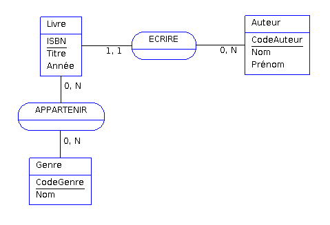

# UTC504-15-10-2024

Cour de tron commun, 28 heures.

But -> se familiariser avec un système d'information et principalement des bases de données.
La conception, son exploitation et la sécurisation d'une base de données.

Qu'est ce qu'un système d'information :
***L'ensemble des ressources, matériels et imatériel necessaire et suffisante pour assurer le bon fonctionnement d'une structure.***

L'urbanisation des SI :

L'urbanisation du système d'information d'une entité ou d'une organisation, qui peut être une entreprise ou une administration, est une discipline d’ingénierie informatique consistant à faire évoluer le système d'information (SI) de celle-ci afin qu'il soutienne et accompagne efficacement les missions de ladite organisation et anticipe ses transformations1. L'urbanisation du SI ne fait pas table rase du passé mais tient compte de l'existant et permet de mieux envisager les évolutions ou contraintes internes et externes affectant le SI, en s'appuyant le cas échéant sur des opportunités technologiques. Les concepts manipulés s'apparentent à ceux de l'urbanisation de l'habitat humain (organisation des villes, du territoire), concepts qui ont été réutilisés en informatique2 pour formaliser ou modéliser la réingénierie du système d'information (SI)

### On-site : les infrastructures sont sur sites.(DGFIP)

### IaaS : Infrastructure as a service(AWS, Orange BZ)
L'IaaS est un service de cloud computing offrant des ressources informatiques matérielles (stockage, réseau, baies de serveurs) au sein d'un environnement virtualisé, par le biais d'Internet ou d'une autre connexion.

**Service Cloud**

Deux type de contrat :
* public : On partage les baies avec d'autre clients.
* privée : On privétise les structures louée.

C'est le système le plus demandé par les entreprises.

### PaaS :  Platform as a service

### Saas :  Software as a Service

Saas privée est le plus sécuriser. Car ton infrasructure dépend des services proposé et donc de leur sécurité. Ils se doivent d'être le plus sécurisé et à jours possible.

## Base de données

* Qu'est ce qu'une base de données ?

Une base de donnée est est un enssemble de données organisé de manière structurés, organisé, et sécurisé.

* Les principales fonctions d'une base de données ?

-Stocker l'information de façon fiable

-Traiter de grand volumes de données 

-Traiter rapidement kes données

-Sécuriser les accès aux données

-Controlle la qualité des données

-Partager les données

-Rendre accécible les données en réseau

Le Data mining est la pratique consistant à rechercher automatiquement de grandes quantités de données afin de découvrir des tendances et des modèles qui vont au-delà de la simple analyse.

* Une base de donnée relationnelle

La base de données permet d'organiser les données en tables (appellé relation)
Chaque case de la table continent une information atomique
Chaque ligne correspond à un objet.
Chaque colonne correspond à une propriété.

* Une base de donnée orienté objet

C'est un type de base de donnée qui a explosé ces dernières année (block chaine)

* SGBD

* Exemples de SGBD

Oracle, Postgres, MySQL, MariaDB, MongoDB....

## étape clé 

Analyse -> extraire -> structurer (MCD ou MEA) -> MLD -> MPD

## MCD (modèle conceptuel de données)

**Une entité** représente un objet ou un concept spécifique qui peut être stocké et manipulé dans une base de données

**Un attribut** est une caractéristique d'une entité susceptible d'être enregistrée dans la base de données. Par exemple, une personne (entité), son nom et son adresse (des attributs). Les attributs sont également appelés des champs ou des colonnes. Dans un MCD un attribut sera toujours souligé

**L'Identifiant** est une propriété unique et soulignée qui est présente dans les entités d'une modélisation MCD Merise.

**Une association** ou relation est donc la représentation d’une liaison logique entre plusieurs entités.
- **La cardinalité** d'une association permet de représenter le nombre minimum et maximum d'instances qui sont autorisées à participer à la relation. La cardinalité est définie pour les deux sens de la relation.
- **Les attributs** d'une association ,l'emprunt d'un livre par une personne à une certaine date par exemple. 
- **le type** d'une association (1,0 ou 0,N etc)

>ORM : Un mapping objet-relationnel (en anglais object-relational mapping ou ORM) est un type de programme informatique qui se place en interface entre un programme applicatif et une base de données relationnelle pour simuler une base de données orientée objet.

## Correction Exo Mini Monde

Considérons la BD ENTREPRISE qui contient les données sur les employés, les services et les projets d’une société. Suite à la collecte de l’analyse des besoins, les
concepteurs fournissent la définition suivante du « minimonde » :

* La société est organisée en services. Chaque service a un nom et un numéro
uniques et est dirigé par un employé unique.
* Un service contrôle un certain nombre de projets, chacun d’entre eux ayant un nom, un numéro et une durée. Un projet ne peut être contrôlé que par un seul service.
* Le nom de chaque employé, son numéro de sécurité sociale, son adresse, son salaire, son sexe et sa date de naissance sont mémorisés. Un employé est affecté à un service, mais peut travailler sur plusieurs projets qui ne sont pas forcément contrôlés par le même service. Le volume du travail d’un employé sur chaque projet est mémorisé.Le supérieur immédiat de chaque employé est lui aussi mémorisé.

Vous allez identifier les entités de la base de données Entreprise ainsi que les
attributs.

| Entités          | Attributs       |
| :---------------: | :---------------: | 
| SERVICES  |   nom, numéro uniques, un employé unique |
| PROJETS  | nom, numéro, durée, un seul service |
| EMPLOYE  | numéro de Sécurité social, adresse, salaire, sexe, dateDeNaissance, IdentifiantSupérieurImmediat |
| SUPERIEUR_IMMEDIAT |numéro de Sécurité social, adresse, salaire, sexe, dateDeNaissance, IdentifiantSupérieurImmediat |