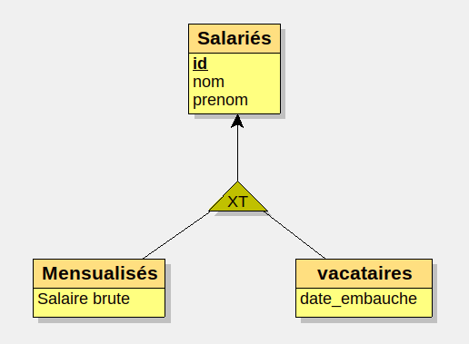
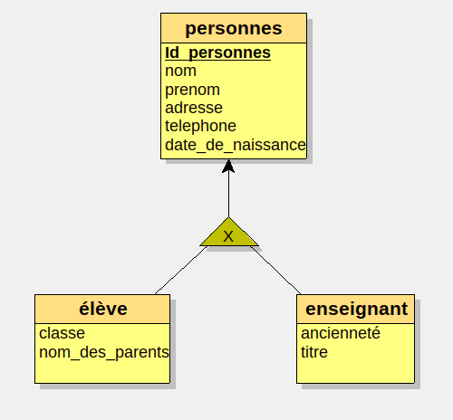
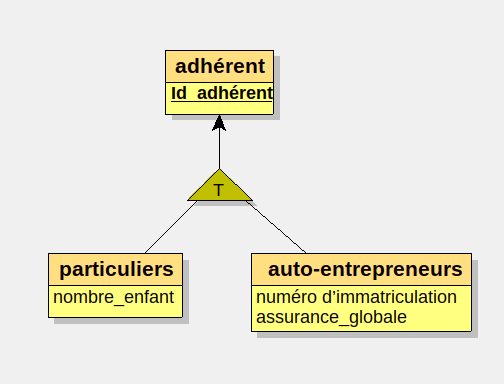

# UTC 504-27-11-2024

## Héritage 

Un indentifiant unique.
un sous-ensembles spécialisation, sans indentifiant.

## Cours_2_Partie2_SI_Gen_Speci-Exemples.pdf

### Exemple 1 :

### Exemple 2 :

### Exemple 3 :

