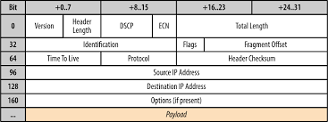

# UTC505 25/11/24

Diamètre de connexion avec TCP en lien avec MSS. (Maximum Segment ...)

Le MSS c'est le diamètre de ségement qui va être envoyé.

## Entête d'un segment Segment TCP

TCP header format :


UDP header format :



TCP (Transport Control Protocol) assure un service de transmission de données fiable avec une détection et une correction d'erreurs de bout en bout. UDP (User Datagram Protocol) offre un service de transmission de datagrammes sans connection.


Automate protocolaire TCP :

Ouverture connexion tcp :


## TP, TCP sys flooding attack

pour faire une attaque DDos :

```
hping3 --syn --flood --rand-source -p 80 192.168.1.2
```

Le moyen ce se defendre sur windows c'est Windows Defender. Il est paramétrable pour dire que si on reçois un nombre de segment sans possibilité de réponsee trop souvent, il stop la reception de ce segment.

